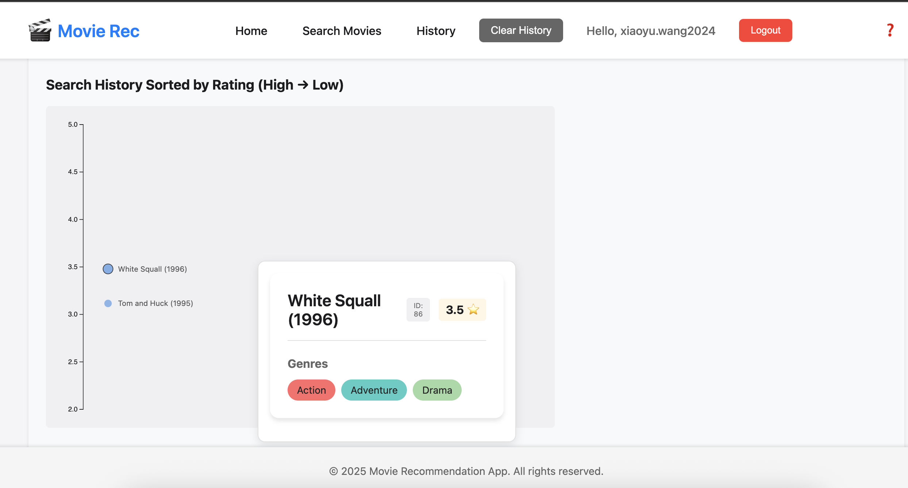

# 🎬 Movie Recommendation Frontend

This is the frontend of the **Movie Recommendation System**, a full-stack web application that allows users to register, log in, browse movie data, rate movies, and get intelligent recommendations based on their history. It communicates with a Spring Boot backend deployed on AWS EC2, and the frontend is hosted via Vercel.

> ⚠️ This project is under active development. Some features are experimental or incomplete.

---

## 🌐 Live Site

- https://frontend.justanotherapp.me  

---

## 🧩 Key Features

- 🔐 **JWT Auth**: Register and login securely
- 🔎 **Movie Search**: Query movies by numeric `movieId`
- 🎨 **Rating Visualization**:
  - Vertical axis sorted by rating (5.0 → top)
  - Dots with color intensity mapped to score
  - Hover to reveal floating movie cards
  - Auto-popup for latest result with debounce + fade
- 🧠 **Smart History**:
  - Avoids duplicate entries
  - Stored in context/localStorage
  - Clear history with one click
- 🧪 **Input Validation**:
  - Accepts only numeric values for movie IDs
  - Real-time feedback for invalid input

---

## 📊 Visualization Example

Interactive timeline of searched movies, built with **D3.js** + React:

---

## 📦 Tech Stack

| Layer         | Tech Stack                                         |
|---------------|----------------------------------------------------|
| Frontend      | React (Vite), React Router, Axios                  |
| State Mgmt    | Context API + localStorage                         |
| Visualization | D3.js + SVG                                        |
| Auth          | JWT via `Authorization: Bearer` header             |
| Deployment    | Vercel (frontend), EC2 (backend) + Cloudflare (DNS)|

---

## 🔗 Related Repositories

- **Backend** (Spring Boot + JWT + REST):  
  👉 [cloud-native-web-application](https://github.com/xiaoyuwang0314/cloud-computing-project/tree/main/cloud-native-web-application)

- **Infrastructure** (Terraform + Packer + EC2):  
  🛠️ [cloud-computing-infra](https://github.com/xiaoyuwang0314/cloud-computing-infra)  
  > ⚠️ *Although this repo contains comprehensive AWS provisioning (e.g., NLB, CloudWatch, multi-tier architecture), the current deployment intentionally simplifies some parts (e.g., no load balancer) to reduce cost. Thus, actual deployment may differ slightly from the Terraform code.*

- **Recommendation Engine (Planned)**  
  > 🚧 Not started yet — still in “thinking real hard about it” phase.
